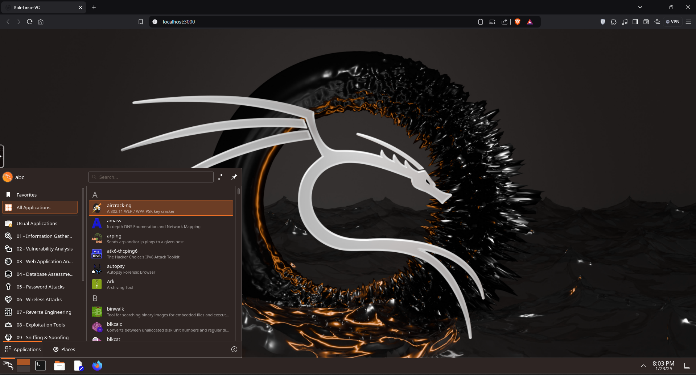

# HackLab

This repository contains configuration files and scripts to set up a Dockerized environment for testing and learning about vulnerabilities using Kali Linux and other related tools. Below is the detailed explanation and usage guide for each component of this repository.



<br>

## Table of Contents
- [Compose File](#compose-file)
- [Batch Script (Windows)](#batch-script-windows)
- [Bash Script (Linux/Mac)](#bash-script-linuxmac)
- [Usage Instructions](#usage-instructions)
- [Components Overview](#components-overview)
- [Network Configuration](#network-configuration)

<br>

## Compose File
The `docker-compose.yml` file defines the services to set up a hacking lab environment. It includes:

### Services:
1. **kali-linux-c**:
   - Based on the `kalilinux/kali-rolling` image.
   - Fixed IP: `172.20.2.5` (internal network).
   - Connected to both `hacking-lab-ex` (external network for internet access) and `hacking-lab-in` (internal network for communication).
   - Configured to restart automatically unless stopped manually.

2. **kali-linux-vc**:
   - Based on `lscr.io/linuxserver/kali-linux`.
   - Supports custom environment variables for user and group IDs (`PUID` and `PGID`), timezone, and title.
   - Fixed IP: `172.20.2.10` (internal network).
   - Connected to both `hacking-lab-ex` (external network for internet access) and `hacking-lab-in` (internal network for communication).
   - Optional GPU connection for Linux hosts.
   - Ports: `3000` and `3001`.

3. **vulnerable-dvwac**:
   - Deploys the `vulnerables/web-dvwa` image.
   - Fixed IP: `172.20.2.3` (internal network).
   - Connected only to `hacking-lab-in` (internal network for communication).
   - Configured to restart automatically unless stopped manually.

### Networks:
- **hacking-lab-ex**:
  - External network for internet access.
  - Subnet: `172.20.1.0/24`.
  - Not marked as internal, allowing internet access for connected containers.

- **hacking-lab-in**:
  - Internal network for communication between containers.
  - Subnet: `172.20.2.0/24`.
  - Marked as `internal: true`, preventing internet access for connected containers.

<br>

## Batch Script (Windows)
The `setup.bat` script simplifies container creation for Windows users.

### Features:
- Prompts for:
  - `PUID` and `PGID`
  - Custom title
  - Ports
  - Shared memory size (`shm-size`)
  - Restart policy
- Automatically runs the Docker container with the provided inputs.

### Usage:
1. Run the script by double-clicking or from the terminal.
2. Follow the prompts to configure the container.
3. The container will be created and started with the specified settings.

<br>

## Bash Script (Linux/Mac)
The `setup.sh` script simplifies container creation for Linux/Mac users.

### Features:
- Interactive prompts for:
  - `PUID` and `PGID`
  - Custom title
  - Ports
  - Shared memory size (`shm-size`)
  - Restart policy
- Automatically constructs and runs the Docker container.

### Usage:
1. Make the script executable: `chmod +x setup.sh`
2. Run the script: `./setup.sh`
3. Follow the prompts to configure the container.
4. The container will be created and started with the specified settings.

<br>

## Usage Instructions
1. Clone this repository:
   ```bash
   git clone https://github.com/RashmithaDeSilva/HackLab.git
   cd HackLab
   ```

   * Before using, set your PC ID in the Compose File (you can get it using the `id` command in the terminal) and replace it with the `PUID` and `PGID` values in the compose file. Also, if you need more access to work, comment out the `security_opt` section in the compose file. If you are using Windows, comment out the `device` section in the compose file.

2. **Using Docker Compose:**
  - Start all services:
    ```bash
    docker compose up -d
    ```
  - Stop all services:
    ```bash
    docker compose down --volumes
    ```
  - Stop all services with imagers:
    ```bash
    docker compose down --volumes --rmi all
    ```

3. **Using Scripts:**
   - On Windows, run `setup.bat`.
   - On Linux/Mac, run `setup.sh`.

4. Access the services via their respective ports (e.g., `http://localhost:3000` for `kali-linux-vc`).

5. Access the `vulnerable-dvwac` container by navigating to `http://172.20.2.3:80` in the `kali-linux-vc` browser. The default username is `admin`, and the password is `password`.

<br>

## Components Overview
### Services
#### kali-linux-c
- A lightweight Kali Linux container for terminal-based tasks.
- Can access the internet and communicate with other containers.

#### kali-linux-vc
- A more feature-rich Kali Linux container with optional GPU support and web-based tools.
- Can access the internet and communicate with other containers.

#### vulnerable-dvwac
- Deploys Damn Vulnerable Web Application (DVWA) for practicing vulnerability testing.
- Cannot access the internet but can communicate with other containers.

### Networks
- **hacking-lab-ex**:
  - Provides internet access to connected containers (`kali-linux-c` and `kali-linux-vc`).
  - Subnet: `172.20.1.0/24`.

- **hacking-lab-in**:
  - Internal network for communication between all containers.
  - Subnet: `172.20.2.0/24`.
  - Marked as `internal: true`, preventing internet access for connected containers.

<br>

## Network Configuration
The `docker-compose.yml` file defines two networks:
1. **hacking-lab-ex**:
   - External network for internet access.
   - Subnet: `172.20.1.0/24`.

2. **hacking-lab-in**:
   - Internal network for communication between containers.
   - Subnet: `172.20.2.0/24`.
   - Marked as `internal: true` to restrict internet access.

<br>

## Notes
- Ensure Docker and Docker Compose are installed on your system.
- Update environment variables as needed in the scripts or compose file.
- This setup is designed for educational purposes and should not be used in production environments without proper security measures.

<br>

Happy hacking!
